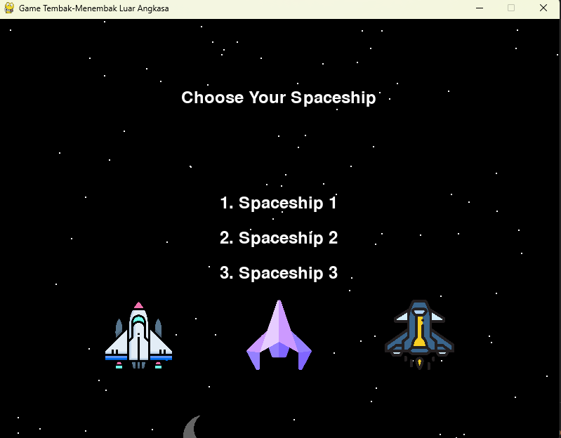
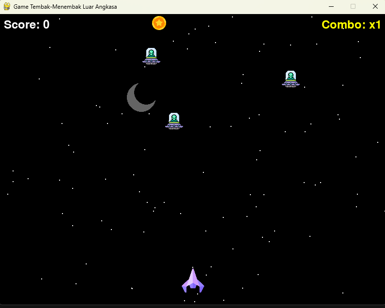

# Space Shooter Game 🚀

Welcome to the Space Shooter Game repository! 🎮

This is a classic space shooter game implemented in Python. Your objective is to navigate your spaceship through the galaxy and shoot down enemy ships while avoiding their attacks. 🌌🚀

## Features ✨

- **Classic Space Shooter Gameplay:** Control a spaceship and defeat waves of enemy ships. 👾🛡️
- **Character Selection:** Choose from multiple characters before starting the game. 🕹️🧑‍🚀
- **High Scores:** Keep track of your high scores and compete with friends. 🏆📈
- **Simple Controls:** Easy-to-learn controls for a fun gaming experience. 🎮👍

## Getting Started 🚀

### Prerequisites 🔧

Make sure you have Python installed on your system. You can download it from [python.org](https://www.python.org/downloads/). 🐍

### Installation ⚙️

1. **Clone the repository:**
    ```bash
    git clone https://github.com/yourusername/space-shooter.git
    ```

2. **Navigate to the project directory:**
    ```bash
    cd space-shooter
    ```

3. **Install Required Libraries:**

    Before running the game, you need to install the required Python libraries. Create a `requirements.txt` file in the project directory with the following content:
    ```plaintext
    pygame
    flask
    ```

    Then, run the following command to install the libraries:
    ```bash
    pip install -r requirements.txt
    ```

4. **Run the game:**
    ```bash
    python space_shooter.py
    ```

### Choosing a Character 🌟

When you start the game, you'll be presented with a character selection screen. Use the arrow keys or mouse to choose your preferred character and then click "Start Game" to begin. 🎮👾

## Screenshots 📸

- **Game Introduction Screen:**
- 
    

  
    *Description: The initial screen when the user enters the game.*

- **Game Start Screen:**
- 
    

  
    *Description: The screen when the user starts the game.*


Happy shooting! 🚀👾
